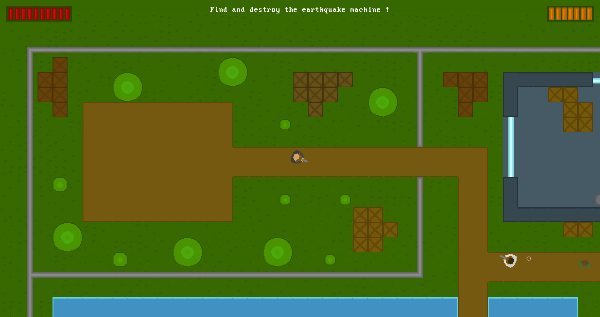

# Operation Earthquake

This is my entry for the [LÖVE JAM 2022](https://itch.io/jam/love2d-jam-2022).  
This is my first ever full project released using this wonderful framework.

All the sprites, sounds effect and music were made during the game jam.  
The font is made by [Zeh Fernando](https://www.dafont.com/fr/perfect-dos-vga-437.font?text=retry&back=bitmap).

## External Tools Used
- [Libresprite](https://libresprite.github.io/#!/)
- [Tiled](https://www.mapeditor.org/)
- [ChipTone](https://sfbgames.itch.io/chiptone)
- [FL Studio](https://www.image-line.com/)

## Usage

This project can be run using the [LÖVE framework](https://love2d.org/)
